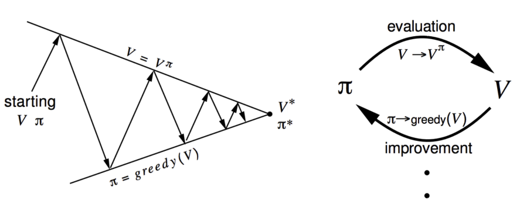

# The basic algrithom in MDP control
## environment
```
python=3.7
numpy=1.19
```
## File explaination
```
gridworld.py        ---- game environment
value_iteration.py  ---- use value iteration to solve
polciy_iteration.py ---- use policy iteration to solve
```

## How to use the files
```
python value_iteration.py
python polciy_iteration.py
```

## Policy Iteration
 * policy evaluation (Iteration on Bellman expectation backup)
 * policy update
 

### evaluation policy (lecture2 page44)
 * (mutiple iterations) **Bellman expectation backup** to get state value  function (lecture2 page35) 
 * compute state-action value of policy π (lecture2 page45)
 * compute new policy for all state based on state-action value
 * redo all steps above
 

## Value Iteration(leture2 page50)
 theory : bellman optimality backup (leture2 page50)
 * init all state value to be zero , V(s) = 0
 * use V to compute Q table
 * V(s) = max_a Q(s,a)
 * redo the two steps above
 
# other intreseting 
[stanford_grid_world](https://cs.stanford.edu/people/karpathy/reinforcejs/gridworld_dp.html)

# to be solved
在policy iteration中，就算evaluation的过程只执行一步，最终也会有同样的policy。怎么解释？

